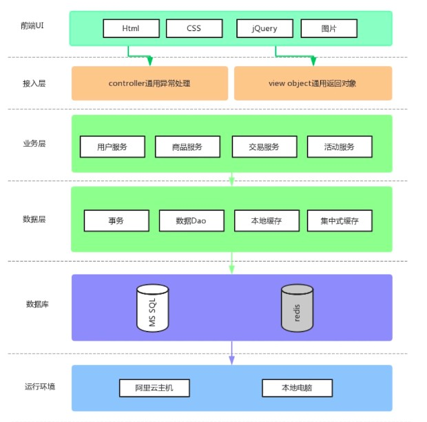

## 1、项目名称

SpringBoot构建电商基础秒杀项目

## 2、项目内容

使用SpringBoot+Mybatis快速搭建前后端分离的电商基础秒杀项目。

## 3、项目搭建环境

- JDK版本：1.8
- 数据库：MySQL5.7
- Maven：3.60
- 开发工具：IntelliJ IDEA 2019
- SpringBoot版本：2.2.1RELEASE

## 4、邮箱联系

**1440113361@qq.com**

## 5、功能完善

1. 引入SpringBoot依赖包实现简单的WEB项目
2. 接入Mybatis，使用Mybatis自动生成器
3. 定义项目的通用对象
4. 定义用户模型（otp验证码、Metronic前端模板、用户注册、登录、检验规则）
5. 商品模型-------商品创建、商品列表、商品列表页面、商品详情页面
6. 交易模型-------交易模型创建、交易下单
7. 秒杀模块-------活动模型创建、活动模型与商品模型结合
8. 完结

## 6、结构图

